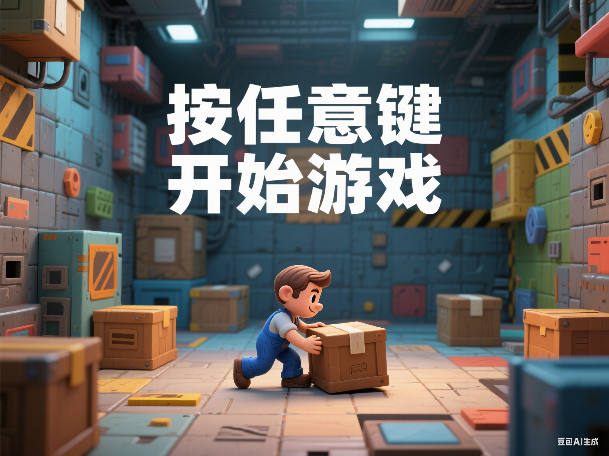

# sokoban-rs 推箱子游戏

本项目基于 Rust 语言实现了经典推箱子游戏（Sokoban）。
在原有版本基础上，我们增加了 **开始界面**、**通关界面**和**音效支持**等等，提升了游戏体验。

原有版本：https://github.com/swatteau/sokoban-rs



---

## 项目简介

推箱子是一款经典益智游戏，玩家需要推动箱子到指定位置完成关卡。
本项目旨在锻炼 Rust 编程和 SDL2 图形音频库的实战能力，适合学习和团队合作开发。

---

## 环境依赖

请先安装 SDL2 及相关开发库，建议使用系统包管理器完成安装：

* Debian/Ubuntu：

  ```bash
  sudo apt-get install libsdl2-dev libsdl2-image-dev libsdl2-ttf-dev
  ```
* Mac OSX（Homebrew）：

  ```bash
  brew install sdl2 sdl2_image sdl2_ttf
  ```

---

## 构建与运行

1. 确保已安装 Rust 开发环境和 Cargo 工具。

2. 在项目根目录下运行：

   ```bash
   cargo build --release
   ```

3. 运行游戏并加载关卡文件（例如 `100Boxes.slc`）：

   ```bash
   cargo run --release -- 100Boxes.slc
   ```

---

## 关卡资源下载

请访问以下地址下载丰富的关卡集合：
[http://www.sourcecode.se/sokoban/levels.php](http://www.sourcecode.se/sokoban/levels.php)

---

## 游戏操作

* 方向键：控制玩家移动
* `R`：重玩当前关卡
* `N`：跳过当前关卡

---

## 新增功能说明

* **开始界面**：游戏启动时显示欢迎和菜单
* **通关界面**：完成所有关卡后展示祝贺信息
* **音效支持**：包含玩家移动、推箱及通关音效，提升沉浸感

---

## 许可证

本项目采用 Apache 2.0 开源许可协议，详情见：
[http://www.apache.org/licenses/LICENSE-2.0](http://www.apache.org/licenses/LICENSE-2.0)
